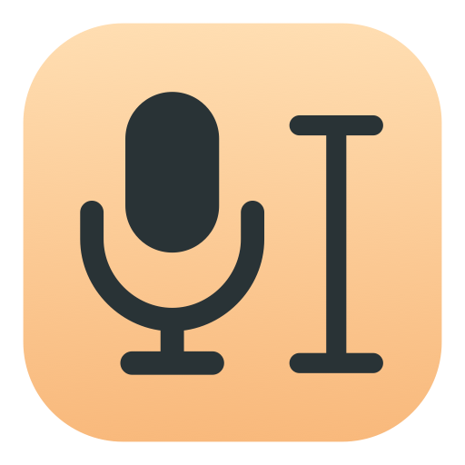

<p align="center">
  
</p>

<h1 align="center">Speak</h1>

<p align="center">Your voice, right where you type.</p>

<p align="center">
  <a href="https://devin.ai"></a>
</p>

<p align="center"><sub>macOS 14 or later on Apple Silicon · <a href="https://github.com/dabit3/speak/releases/latest">Release notes and checksum</a></sub></p>

Speak is a small macOS menu bar app that turns speech into text with OpenAI GPT-Live-Transcribe. Hold <kbd>fn</kbd> to dictate. Release it to paste your words into the active app.

[Download for macOS](https://github.com/dabit3/speak/releases/latest/download/Speak-1.1.4-arm64.dmg)

## For users

You need an Apple Silicon Mac running macOS 14 or later, internet access, and an OpenAI API key. You do not need Xcode.

1. Click the download link above and open the Speak `.dmg` installer.
2. Drag Speak into Applications. Open Speak.
3. In Preferences, add your OpenAI API key.
4. Allow Microphone and Accessibility access.

OpenAI API usage is billed separately from ChatGPT subscriptions. The published installer is Developer ID signed and notarized by Apple.

### Shortcuts

| Shortcut | Action |
| :--- | :--- |
| Hold <kbd>fn</kbd> | Record your voice. Release to paste. |
| <kbd>fn</kbd> + <kbd>space</kbd> | Start or stop hands-free dictation. |
| <kbd>esc</kbd> | Cancel without pasting. |

You can choose Control + Option or add vocabulary hints in Preferences. Turn off “Show live text above pill” to hide the transcript while recording.

### Formatting and corrections

Speak formats English dictation on your Mac before it pastes. Say “comma,” “period,” “question mark,” “exclamation point,” “colon,” “new line,” or “new paragraph” to add punctuation. Speak writes numbers of 10 or more, times, dates, prices, percentages, and versions as digits. For example, “three thirty pm” becomes “3:30 PM” and “twenty five dollars” becomes “$25.” Small counts in ordinary sentences, such as “two options,” stay as words. Spoken email addresses like “nader at example dot com” become “nader@example.com.” Speak also removes “um” and “uh.”

Smart correction is on by default and uses GPT-4.1 nano. It fixes likely misheard words and punctuation. It also applies corrections you make while speaking. For example, “Let’s meet at 3, no wait, 4” becomes “Let’s meet at 4.” It allows up to 350 ms of extra wait, or 1 second when you correct yourself. After that, it falls back to the formatted text. Choose “Copy original dictation” from the menu bar to recover the unedited transcript. Turn off “Smart correction” in Preferences to skip AI edits.

### Privacy

Speak stores your API key in macOS Keychain. Audio streams directly to OpenAI during dictation. Smart correction also sends transcript text, vocabulary, and the active app name to OpenAI, with extra text API charges. Speak keeps only the last original and corrected transcripts in memory, with no recordings or history saved to disk.

OpenAI’s API data policies still apply.

## For developers

Building from source requires Xcode with Swift 6 or later. The build selects your installed Developer ID certificate. If several certificates exist, set `CODE_SIGN_IDENTITY` to choose one.

For temporary local builds, use `CODE_SIGN_IDENTITY=- bash scripts/build.sh`. This changes the app identity on each rebuild and can break existing Accessibility approval.

```sh
bash scripts/build.sh
open build/artifacts.noindex/Speak.app
```

Run tests with `swift test`. After building the app, create an installer with `bash scripts/package-dmg.sh`. The script writes the DMG to `build/`.

New builds need their own Apple notarization before public distribution. Submit the DMG with `notarytool`, attach its approval with `stapler`, and regenerate the checksum. Packaging alone does not notarize a release. After publishing a GitHub release, update the DMG filename in the download link at the top of this README.
